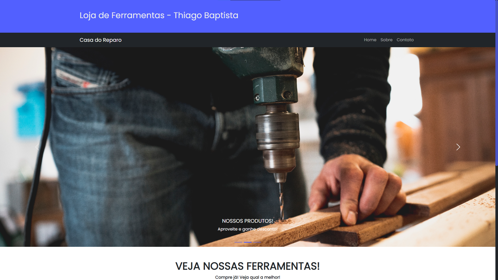

# Loja de Ferramentas - Thiago Baptista da Silva Soares

# 🛠️ Loja de Ferramentas com React
Neste projeto, cada aluno da sala de aula recebeu um tema específico para desenvolver seu próprio site, utilizando o React Bootstrap como ferramenta auxiliar. Durante o processo, foram criados diversos componentes e eles foram adicionados de acordo com as necessidades identificadas.

## 🔧 Funcionalidades

- Exibição de três diiferentes páginas. (Home, Sobre e Contato);
- Utilização de Cabeçalho, Barra de Navegação, Carrossel de Imagens, Card's e Rodapé;
- Apresenta um layout simples e minimalista, com elementos visuais atrativos e de fácil leitura. A cor lilás foi a escolhida para representar o site.

## 🧰 Orientações de Utilização

1. Certifique-se de ter o Node.js instalado em sua máquina;
2. Faça o clone deste repositório em sua máquina;
3. Navegue até o diretório do projeto no terminal.
4. Execute o comando **npm install** para instalar as dependências necessárias;
6. Execute o comando **npm dev** para abrir o projeto em seu navegador;
7. Execute o comando **npm run server** para ver quais produtos estão adicionados no arquivo db.json.

#### Este é um projeto escolar desenvolvido por Thiago Baptista da Silva Soares. Sinta-se à vontade para personalizar e aprimorar este projeto, adicionando diferentes recursos ou modificando o design para atender às suas necessidades. 💜
